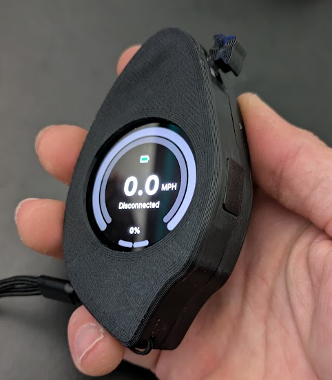
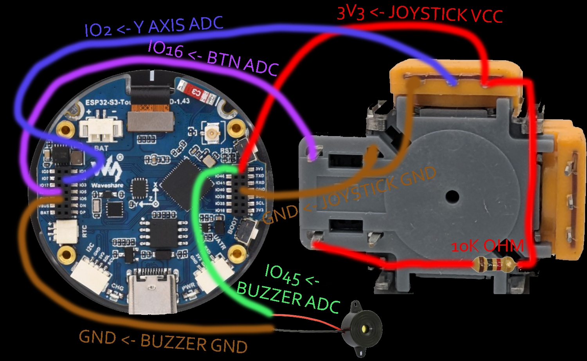
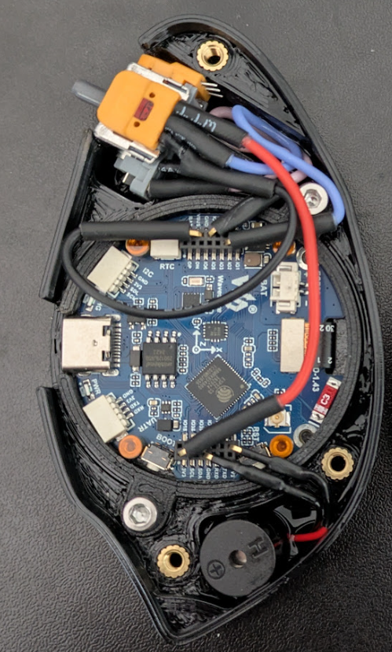
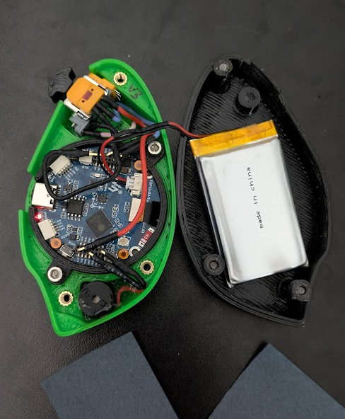

# Leaf Blaster example build

By ZiNc

## Parts

- [WaveShare 1.43in Amoled display](https://www.waveshare.com/esp32-s3-touch-amoled-1.43.htm?sku=30106)
- [PS5 hall joystick](https://www.aliexpress.us/item/3256806823053436.html)
- Battery
  - [1500mAh Lipo battery](https://www.amazon.com/dp/B09DPNCLQZ)
  - [1.25mm JST connectors](https://www.amazon.com/dp/B088NQBF3V)
- Case
  - [ZiNc Leaf Blaster remix case](https://www.printables.com/model/1265591) by ZiNc
  - [Leaf Blaster case](https://www.printables.com/model/1191785) by Markoblaster
  - 5 x [M3xD5xL4 heat set inserts](https://www.amazon.com/dp/B0CS6VZYL8)
  - 3 x M3x20 countersunk screws
  - 2 x M3x8 cap head screws
  - 6 x 1.27mm header pins
  - 1 x 10k Ohm resistor

## Instructions

1. Print all required case parts
  - Install 5 x M3 heat set inserts into lid
2. Solder PS5 hall effect joystick according to Leaf Blaster configuration (see following), having all wires terminated with 1.27mm header pins
  - Y AXIS ADC -> IO2
  - BTN ADC -> IO16
  - BTN ADC -> 10k-20k Ohm (Pull-Up) -> 3V3
  - BTN VCC -> 3V3
  - BTN GND -> GND

3. If buzzer is desired, terminate buzzer wires with 1.27mm header pins
  - BUZZER ADC -> IO45
  - BUZZER GND -> GND

4. Connect PS5 hall effect joystick to WaveShare display GPIO headers (see image)
5. Connect buzzer to WaveShare display GPIO headers if desired (see image)

6. Connect 1.25mm JST battery to display

 
8. Assemble all parts and screw case together
9. Install a lanyard if you like!

10. You're ready to start [setting up your Pubmote software](/docs/quick-start.md)!
