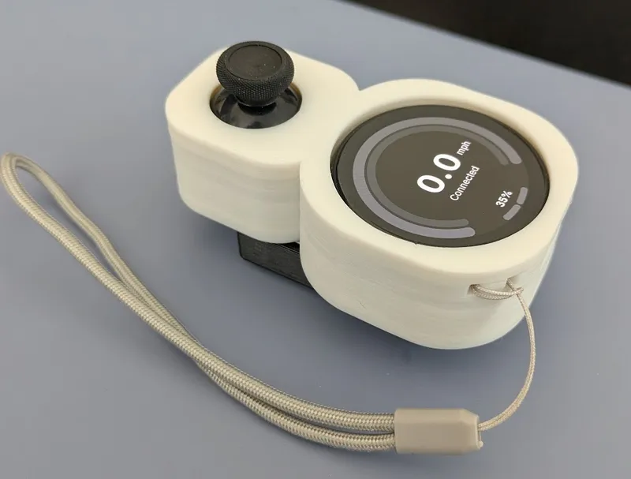

# Snowmote example build

By ZiNc

## Parts

- The ["Cowmote"](https://cowpowersystems.com/product/1) from ExcessRaccoon uses the [LilyGo T-Display S3 Amoled (1.43in)](https://lilygo.cc/products/t-display-s3-amoled-1-64?variant=44507650556085)
- [PS5 hall joystick](https://www.aliexpress.us/item/3256806823053436.html)
- Battery
  - [1500mAh Lipo battery](https://www.amazon.com/dp/B09DPNCLQZ)
  - [1.25mm JST connectors](https://www.amazon.com/dp/B088NQBF3V)
- Case
  - [SnowMote case](https://www.printables.com/model/1143449) by ZiNc
  - 5 x M1.7x3 screws

## Instructions

1. Print all require case parts!
2. Place battery into its case (if desired) and zip tie this to the Floor piece

4. Install data wire between main PCB and joystick breakout board

5. Install main PCB and joystick breakout board on Floor piece

6. Connect power to LilyGo display and install onto main PCB with the UCB-C port on the display facing away from the joystick

7. Close lid over top of assembled board and snap to fit together

8. Install a lanyard if you like!
9. You're ready to start [setting up your Pubmote software](/docs/quick-start.md)!
