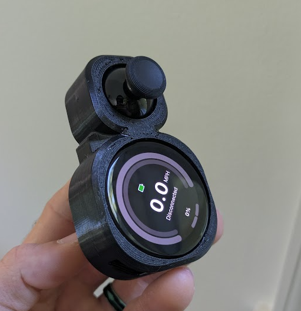
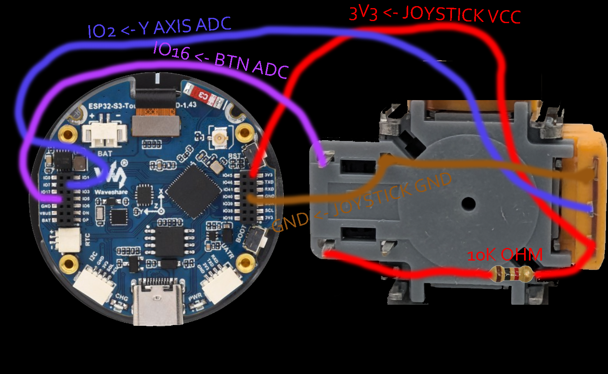
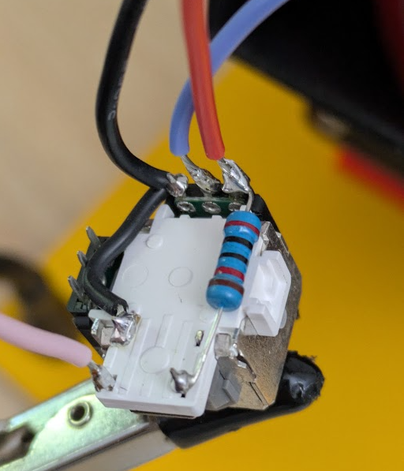
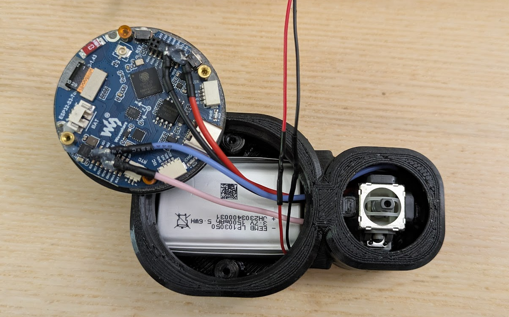

# Snowmote 2 example build

By ZiNc

## Parts

- [WaveShare ESP32-S3 1.43in Amoled Display](https://www.waveshare.com/esp32-s3-touch-amoled-1.43.htm)
- [PS5 hall joystick](https://www.aliexpress.us/item/3256806823053436.html)
- Battery
  - [1500mAh Lipo battery](https://www.amazon.com/dp/B09DPNCLQZ)
  - [1.25mm JST connectors](https://www.amazon.com/dp/B088NQBF3V)
- Case
  - [SnowMote 2 case](https://www.printables.com/model/1410737) by ZiNc
  - 2 x M2x8 screws (or M2x12 screws, depending on your printer tolerances)
  - 4 x 1.27mm header pins
  - 1 x 10k Ohm resistor

## Instructions

1. Print all required case parts
2. Solder PS5 joystick according to Snowmote 2 configuration (see following), having all wires terminated with 1.27mm header pins or similar
  - Y AXIS ADC -> IO2
  - BTN ADC -> IO16
  - BTN ADC -> 10k-20k Ohm (Pull-Up) -> 3V3
  - BTN VCC -> 3V3
  - BTN GND -> GND

3. Install prepared PS5 joystick into floor piece, setting it into the receiving seat.
  - Use silicone or glue as you see fit to fix the joystick in place in the floor piece

4. Connect PS5 hall effect joystick to WaveShare display GPIO headers (see image)
  - Run wires from the back of the lid through the front, into the display GPIO headers. This allows the display to sit in the lid

5. Connect 1.25mm JST battery to display
  - Install battery and route wires similarly
  - The battery will sit underneath of the PS5 joystick wires and display

6. Snap the floor into the lid piece and organize the wires as you see fit

7. Carefully lay the display into the seat in the lid and install the 2 x M2 screws through the floor into the posts on the display
  - Be very, very gentle when screwing into the threaded display posts. They are not very strong. The moment the screw has resistance in the display posts, stop tightening.
  - If you happen to break one off, a little superglue or other adhesive can bond it back in, with some care.

8. Install a lanyard and thumbstick if you like!

9. You're ready to start [setting up your Pubmote software](/docs/quick-start.md)!
