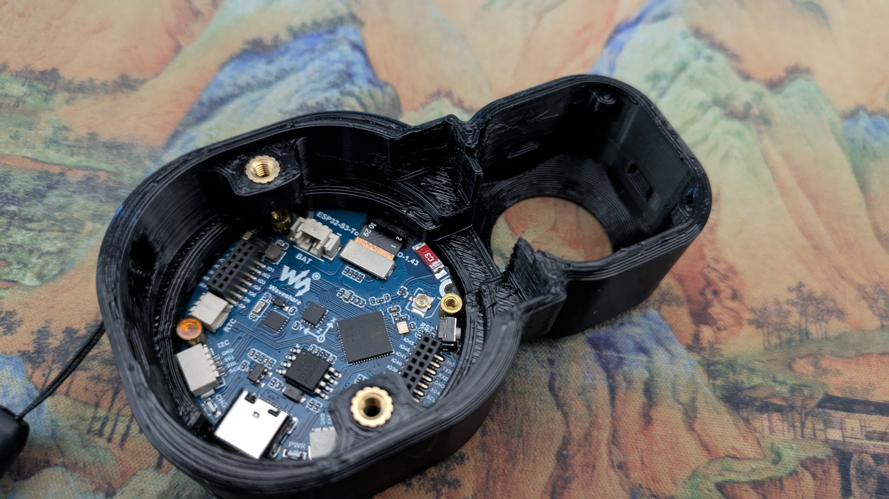
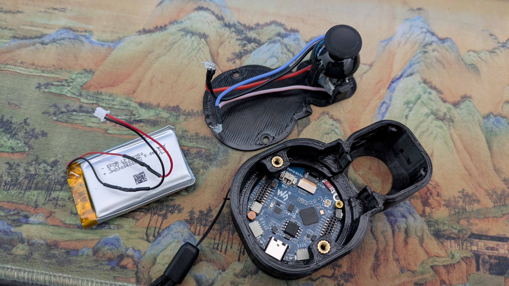
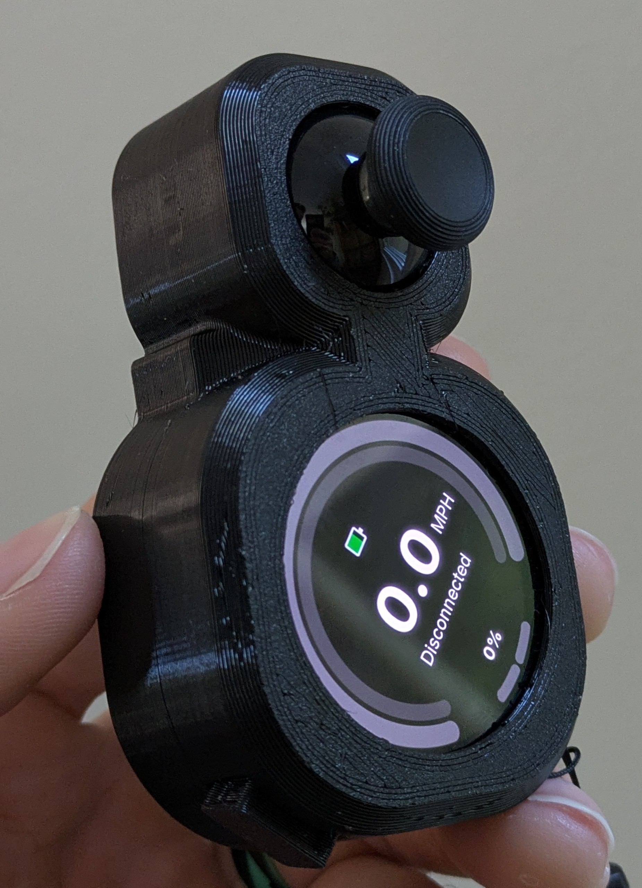

# Snowmote 2 example build

By ZiNc

## Parts

- [WaveShare ESP32-S3 1.43in Amoled Display](https://www.waveshare.com/esp32-s3-touch-amoled-1.43.htm)
- [PS5 hall joystick](https://www.aliexpress.us/item/3256806823053436.html)
- Battery
  - [1500mAh Lipo battery](https://www.amazon.com/dp/B09DPNCLQZ) (this is the one the case is designed for, but others of similar dimensions or smaller will work)
  - [1.25mm JST connectors](https://www.amazon.com/dp/B088NQBF3V)
- Case
  - [SnowMote 2 case](https://www.printables.com/model/1410737) by ZiNc
  - 2 x M3x5 countersunk screws
  - 2 x [M3xD5xL4 heat set inserts](https://www.amazon.com/dp/B0CS6VZYL8)
  - 4 x 1.27mm header pins
  - 1 x Pull-up resistor (10k Ohm will do)

## Instructions

1. Print all required case parts
2. Install heat set inserts into the printed lid piece in the holes facing the floor
3. Solder PS5 joystick according to Snowmote 2 configuration (see following), having all wires terminated with 1.27mm header pins or similar
  - Y AXIS ADC -> IO2
  - BTN ADC -> IO16
  - BTN ADC -> 10k-20k Ohm (Pull-Up) -> 3V3
  - BTN VCC -> 3V3
  - BTN GND -> GND

4. Install prepared PS5 joystick into floor piece, setting it into the receiving seat.
  - Use silicone or glue as you see fit to fix the joystick in place in the floor piece

5. Secure WaveShare display into the lid
  - Tackle this however you see fit... but in my experience, sliding it into the FRONT of the lid piece at an angle and slowly working the lid lip over the display in a circular fashion was successful
  - The display should have just enough room to wiggle around and set the direction once it's been slotted into the lid
  

6. Connect PS5 hall effect joystick to WaveShare display GPIO headers (see image)
  - Run wires from the back of the lid through the front, into the display GPIO headers. This allows the display to sit in the lid

7. Connect 1.25mm JST battery to display
  - Install battery and route wires similarly
  - The battery will sit underneath of the PS5 joystick wires and display

8. Snap the floor into the lid piece and organize the wires as you see fit
  - The battery and joystick wires will need to be routed as the case is snapped together
  - It's never a bad idea to place some insulation between the battery and the GPIO headers on the WaveShare display (Fish paper or otherwise)

9. Install the 2 x M3 screws through the floor into the heat set inserts in the lid

10. Install a lanyard and thumb stick cover as you like!

11. You're ready to start [setting up your Pubmote software](/docs/quick-start.md)!
