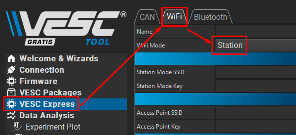
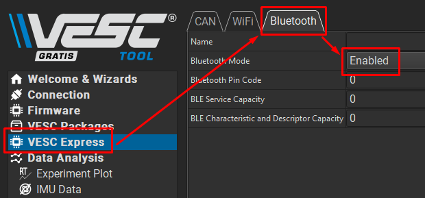
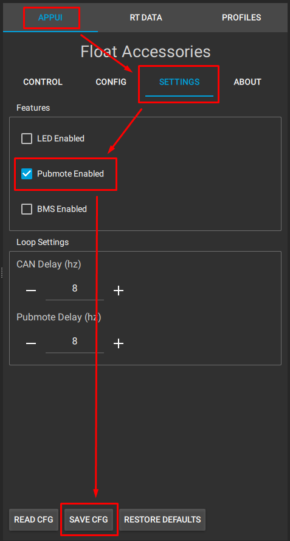
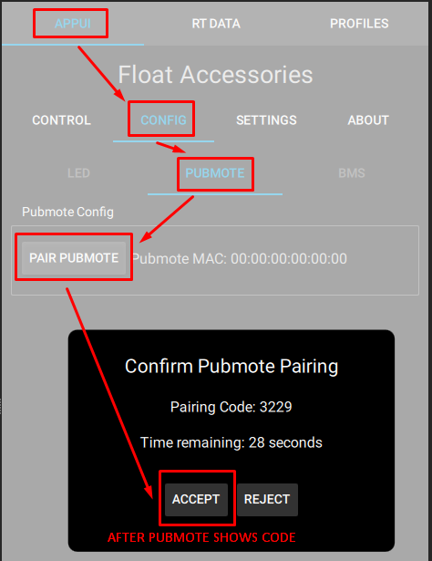
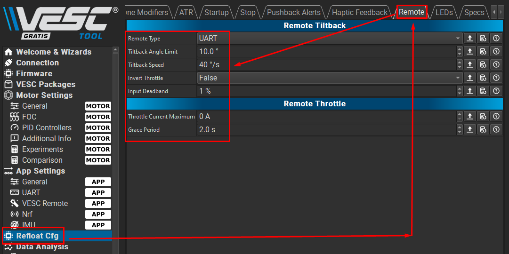

# Pubmote Quick Start Guide

## First-Time Pubmote Setup

1. Ensure you have completed the [Hardware Prerequisites](/README.md#hardware-prerequisites)
2. Flash your Pubmote's ESP32-S3 controller using the included flashing tool at [pubmote.techfoundry.nz](https://pubmote.techfoundry.nz/)
3. Configure Pubmote settings:
    - On the Pubmote, navigate to the main menu by swiping down from the top of the main screen
    - Select "Settings" and swipe through the options to set your preferences
    - Select "Save" to apply your settings

4. Calibrate your Pubmote:
    - On the Pubmote, navigate to the main menu by swiping down from the top of the main screen
    - Select "Calibration"
    - Select "Start" and move through the steps, selecting "Next" to continue each step, and "Save" to store your calibration.
        - For "Move stick to center", allow the joystick to sit steady.
        - For "Move stick to min/max", move the joystick smoothly to its limits of motion in all directions.
        - For "Move stick within deadband", move the joystick just slightly off-center. This will set the inner radius the Pubmote treats as no input.
        - For "Set expo factor", you may leave this at 1.00 or adjust for more or less input to tilt ratio.
        - For "Invert Y", you may check or uncheck this to flip the direction of the Y axis input.
        - View the graph for testing and save your calibration.

5. Pair the remote to your VESC Express:
    
    1. If you haven't already, install Float Accessories on your VESC Express:
        - Instructions for this may be found at the bottom of [pubmote.techfoundry.nz](https://pubmote.techfoundry.nz)
    2. Configure your VESC Express wifi and bluetooth settings:
        - Navigate to VESC Express > WiFi > WiFi Mode: Set this to "Access Point"
        - Navigate to VESC Express > Bluetooth > Bluetooth Mode: Set this to "Enabled" or "Enabled with Scripting" (if needed)

    
    

    3. Configure your VESC Express Float Accessories settings:
        - Navigate to App UI > Settings > Pubmote Enabled
        - Ensure this is checked
        - Save and restart as necessary

    

    4. Launch Pubmote pairing:
        - On the Pubmote, navigate to the main menu by swiping down from the top of the main screen
        - Select "Pairing" and start the pairing on the Pubmote
    5. Launch VESC Express Pubmote pairing:
        - Navigate to App UI > Config > Pair Pubmote

    
    

    6. Confirm the pairing code on both the Pubmote and VESC Express
    7. You should now be connected!

6. Ensure you've completed the package-side setup. For refloat:
    1. Navigate to Refloat Cfg > Remote
    2. Ensure Remote Type is set to "UART"
    3. Ensure Tiltback Angle Limit is above 0 degrees
    4. Ensure Tiltback Speed is above 0 degrees/second
    5. Ensure Input Deadband is below 100%, but at least 1%.
    6. Set Throttle Current Maximum to 0, unless you intend to use remote throttle for fun
    
    

7. Go ride!

## Usage

While the homescreen is active, tilting the joystick will apply remote input to your VESC.

Some common scenarios where a tilt remote may be useful:
- Going up a hill, raising the nose angle
- Going down a hill, lowering the nose angle
- Accelerating quickly, raising the nose angle
- Decelerating quickly, lowering the nose angle
- Riding into headwind, lowering the nose angle to require less leaning into the wind
- Landing drops more level, lowering the nose
- Bonks or climbs over large objects, to gain clearance on the approach and exit
- Putting your friends through a Bucking Bronco mini game on your board
- Nose slides
- Tail drags
- Balance recovery
- And whatever else you might come up with!

## Common Issues and Mistakes

### The Pubmote won't connect / stay connected

1. If VESC Express -> WiFi -> WiFi Mode is set to "Station Mode", it will cause connection failures with Pubmote.

The fix: It must be set to "Access Point"

### The Pubmote is connected but not doing anything to the board tilt

1. If VESC Controller -> Refloat Cfg -> Remote ->
      - Remote Type is not set to UART
      - Tiltback Angle Limit is set to 0 °
      - Tiltback Speed is set to 0 °/s
      - Input Deadband is set to a very high %

The fix: Ensure Remote Type of  UART, Tiltback Angle Limit of >0 °, Tiltback Speed of >0 °/s, and a relatively low Input Deadband

### My Float Accessories package isn't connecting to my Refloat/Float package

1. If your VESC Express and VESC Controller firmware versions are different, this will prevent communication
2. If your CAN communication between the VESC Express and VESC Controller is not functioning properly, this will prevent communication

### Pairing on the remote is stuck on 0000 when trying to pair to controller

The fix: Ensure that...
1. Both the VESC Express and your VESC are on at least version 6.05, as this is necessary for Float Accessories
2. Float Accessories is not crashing (check the LispBM Scripting tab in VESC Tool for information)

### The direction of the tilt is backwards

The fix: Re-run calibration and check "Invert Y"

### My remote is showing 0% board battery all the time

This is a known incompatibility with versions of Refloat package before 1.1, and all Float package versions. Update to Refloat 1.1 to resolve.
